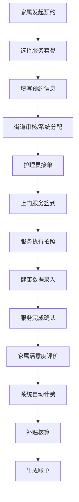

## 1. 产品概述

社区养老服务协同平台，为街道工作人员、护理员和家属提供一站式养老服务管理解决方案。通过数字化手段提升养老服务效率，保障老人健康安全，实现多方协同办公。

- **核心价值**：打通养老服务全流程，实现服务可追溯、健康可监测、费用可核算、满意度可评估
- **目标用户**：街道管理人员、上门护理员、老人家属

## 2. 核心功能

### 2.1 用户角色

| 角色 | 注册方式 | 核心权限 |
|------|----------|----------|
| 街道工作人员 | 后台分配账号 | 老人档案管理、服务套餐配置、护理员排班、运营数据看板、补贴核算 |
| 护理员 | 后台分配账号 | 查看任务、到场签到、服务拍照、健康记录、异常上报 |
| 家属 | 自助注册/邀请绑定 | 查看老人档案、服务预约、健康记录查看、消息接收、满意度评价 |

### 2.2 功能模块

1. **老人档案**：基本信息、能力评估、慢病标签、紧急联系人、家属授权
2. **服务预约**：服务套餐选择、预约时间、护理员指派、预约状态跟踪
3. **上门任务**：任务列表、路线查看、到场签到、服务拍照确认
4. **健康记录**：血压血糖记录、用药提醒、健康趋势图表、异常预警
5. **紧急联系人**：联系人管理、一键呼叫、紧急事件上报
6. **费用补贴**：补贴额度核算、账单查询、费用明细、支付记录
7. **家属消息**：消息推送、服务通知、消息回执、满意度回访
8. **运营看板**：数据统计图表、风险老人筛选、生日关怀提醒、服务质量分析

### 2.3 页面详情

| 页面名称 | 模块名称 | 功能描述 |
|----------|----------|----------|
| 老人档案 | 档案列表 | 老人信息卡片展示、搜索筛选、新增/编辑档案 |
| 老人档案 | 能力评估 | ADL评估量表、评估结果记录、历史评估对比 |
| 老人档案 | 慢病管理 | 慢病标签选择、病史记录、用药情况 |
| 服务预约 | 套餐选择 | 服务套餐展示、套餐详情、价格说明 |
| 服务预约 | 预约表单 | 选择老人、服务项目、时间、护理员偏好 |
| 服务预约 | 预约管理 | 预约列表、状态变更、取消/改期 |
| 上门任务 | 任务看板 | 今日任务、待完成、已完成任务分类 |
| 上门任务 | 路线规划 | 任务地点地图展示、最优路线推荐 |
| 上门任务 | 签到确认 | GPS定位签到、服务前拍照、服务后拍照 |
| 健康记录 | 数据录入 | 血压、血糖、心率等健康指标录入 |
| 健康记录 | 趋势分析 | 健康数据折线图、异常值标注 |
| 健康记录 | 用药提醒 | 用药计划设置、提醒推送、服药记录 |
| 紧急联系人 | 联系人列表 | 联系人信息管理、关系标注、优先级设置 |
| 紧急联系人 | 异常上报 | 异常事件描述、照片上传、紧急联系人通知 |
| 费用补贴 | 补贴核算 | 补贴政策配置、额度自动计算、审批流程 |
| 费用补贴 | 账单管理 | 月度账单、费用明细、支付状态 |
| 家属消息 | 消息中心 | 系统通知、服务提醒、紧急消息分类 |
| 家属消息 | 满意度回访 | 服务评价、评分、意见反馈 |
| 运营看板 | 数据概览 | 服务人次、老人总数、护理员在岗数 |
| 运营看板 | 风险筛选 | 高危老人标签、健康异常预警、独居老人提醒 |
| 运营看板 | 生日关怀 | 近期生日老人列表、生日祝福模板 |

## 3. 核心流程

### 3.1 服务预约流程
家属选择服务套餐 → 填写预约信息 → 系统分配护理员 → 护理员确认接单 → 上门服务签到 → 服务完成拍照 → 家属确认评价

### 3.2 健康监测流程
护理员上门测量 → 录入健康数据 → 系统自动分析异常 → 异常数据推送家属 → 医生/街道跟进处理

### 3.3 费用结算流程
服务完成 → 系统自动计费 → 补贴抵扣计算 → 生成月度账单 → 家属支付/街道补贴结算

## 4. 用户界面设计

### 4.1 设计风格

- **主色调**：温暖的青绿色 (#2DD4BF) 作为主色，代表关怀与健康
- **辅助色**：柔和的橙色 (#FB923C) 用于强调和提醒，浅灰色背景营造舒适感
- **按钮风格**：圆角矩形按钮，悬停时有轻微上浮效果和阴影变化
- **字体**：使用 Noto Sans SC 中文字体，标题使用粗体，正文清晰易读
- **布局风格**：卡片式布局，左侧导航栏 + 顶部状态栏 + 主内容区
- **图标风格**：使用线性图标，统一线条粗细，色彩柔和

### 4.2 页面设计概览

| 页面名称 | 模块名称 | UI 元素 |
|----------|----------|---------|
| 运营看板 | 数据概览 | 大数字统计卡片、趋势小图表、颜色区分数据类型 |
| 老人档案 | 档案列表 | 头像卡片、标签云、搜索筛选栏、分页 |
| 上门任务 | 任务看板 | 时间线布局、状态标签颜色区分、地图缩略图 |
| 健康记录 | 趋势分析 | 多线条折线图、异常点红色标注、数据表格 |
| 服务预约 | 套餐选择 | 卡片横向排列、价格突出显示、套餐对比 |

### 4.3 响应式设计

- **桌面优先**：1440px 基准设计，适配 1280px - 1920px 屏幕
- **平板适配**：导航栏可收起，内容区自适应宽度
- **移动端**：底部 Tab 导航，卡片垂直堆叠，优化触摸区域

### 4.4 动效设计

- 页面切换使用淡入淡出过渡
- 数据卡片加载时使用渐入动画
- 按钮悬停有轻微缩放和阴影变化
- 状态变更有平滑过渡效果
