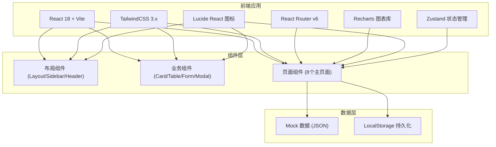
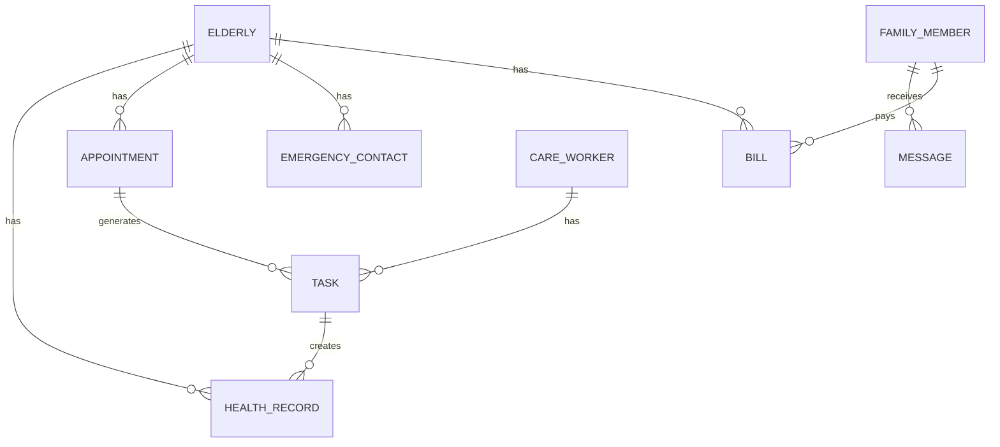

## 1. 架构设计



## 2. 技术栈说明

- **前端框架**：React@18 + TypeScript + Vite@5
- **样式方案**：TailwindCSS@3.x + CSS Variables
- **路由管理**：React Router v6
- **状态管理**：Zustand (轻量级状态管理)
- **图表库**：Recharts (健康数据趋势图)
- **图标库**：Lucide React
- **数据持久化**：LocalStorage (Mock 数据存储)
- **构建工具**：Vite

## 3. 路由定义

| 路由路径 | 页面名称 | 说明 |
|----------|----------|------|
| / | 运营看板 | 首页，数据概览和运营统计 |
| /elderly | 老人档案 | 老人信息管理、能力评估、慢病标签 |
| /appointments | 服务预约 | 服务套餐选择、预约管理 |
| /tasks | 上门任务 | 护理员任务看板、签到、路线 |
| /health | 健康记录 | 血压血糖记录、用药提醒 |
| /contacts | 紧急联系人 | 联系人管理、异常上报 |
| /finance | 费用补贴 | 补贴核算、账单查询 |
| /messages | 家属消息 | 消息中心、满意度回访 |

## 4. 数据模型

### 4.1 核心实体关系



### 4.2 主要数据结构

```typescript
// 老人档案
interface Elderly {
  id: string;
  name: string;
  gender: 'male' | 'female';
  age: number;
  birthDate: string;
  idCard: string;
  phone: string;
  address: string;
  avatar: string;
  abilityLevel: 'independent' | 'semi-dependent' | 'dependent';
  chronicDiseases: string[];
  emergencyContacts: EmergencyContact[];
  familyMembers: FamilyMember[];
  riskTags: string[];
}

// 服务预约
interface Appointment {
  id: string;
  elderlyId: string;
  elderlyName: string;
  servicePackageId: string;
  servicePackageName: string;
  scheduledTime: string;
  status: 'pending' | 'confirmed' | 'completed' | 'cancelled';
  careWorkerId?: string;
  careWorkerName?: string;
  createTime: string;
}

// 上门任务
interface Task {
  id: string;
  appointmentId: string;
  elderlyId: string;
  elderlyName: string;
  elderlyAddress: string;
  careWorkerId: string;
  careWorkerName: string;
  serviceItems: string[];
  scheduledTime: string;
  checkInTime?: string;
  checkOutTime?: string;
  photos: string[];
  status: 'pending' | 'in_progress' | 'completed';
  location?: { lat: number; lng: number };
}

// 健康记录
interface HealthRecord {
  id: string;
  elderlyId: string;
  recordTime: string;
  bloodPressureSystolic?: number;
  bloodPressureDiastolic?: number;
  bloodSugar?: number;
  heartRate?: number;
  temperature?: number;
  notes?: string;
  recordedBy: string;
  isAbnormal: boolean;
}

// 紧急联系人
interface EmergencyContact {
  id: string;
  elderlyId: string;
  name: string;
  relationship: string;
  phone: string;
  priority: number;
  isPrimary: boolean;
}

// 账单
interface Bill {
  id: string;
  elderlyId: string;
  month: string;
  totalAmount: number;
  subsidyAmount: number;
  actualAmount: number;
  status: 'unpaid' | 'paid' | 'subsidized';
  items: BillItem[];
  createTime: string;
}

// 消息
interface Message {
  id: string;
  recipientId: string;
  recipientType: 'family' | 'worker' | 'admin';
  title: string;
  content: string;
  type: 'system' | 'service' | 'emergency' | 'survey';
  isRead: boolean;
  createTime: string;
  relatedId?: string;
}
```

## 5. 目录结构

```
src/
├── assets/              # 静态资源
├── components/          # 通用组件
│   ├── layout/         # 布局组件
│   ├── ui/             # UI 基础组件
│   └── business/       # 业务组件
├── pages/              # 页面组件
│   ├── Dashboard.tsx
│   ├── Elderly.tsx
│   ├── Appointments.tsx
│   ├── Tasks.tsx
│   ├── Health.tsx
│   ├── Contacts.tsx
│   ├── Finance.tsx
│   └── Messages.tsx
├── store/              # 状态管理
│   └── useStore.ts
├── data/               # Mock 数据
│   └── mockData.ts
├── types/              # TypeScript 类型定义
│   └── index.ts
├── utils/              # 工具函数
├── App.tsx
├── main.tsx
└── index.css
```
